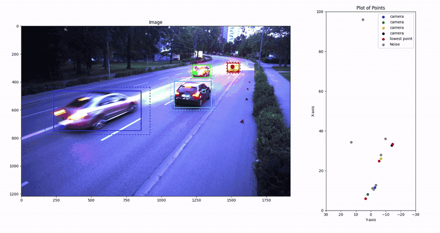
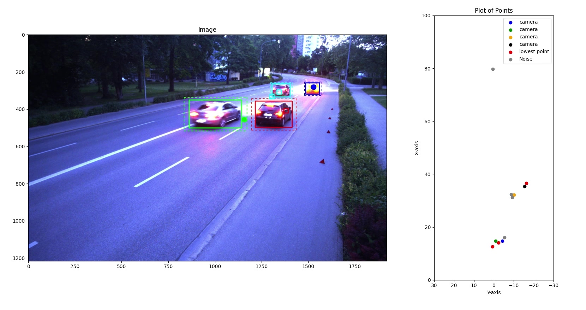
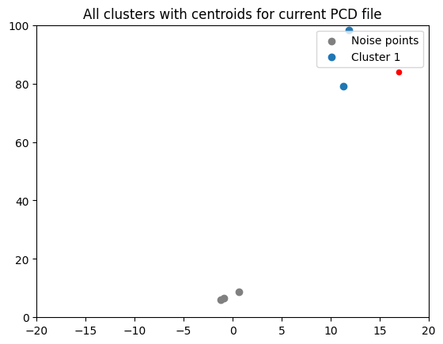
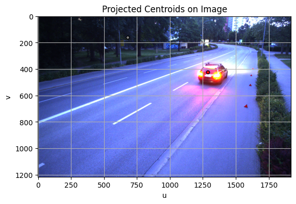

# Camera-Radar Sensor Data Fusion

Late fusion of camera and automotive radar for roadside infrastructure perception, built on the public INFRA-3DRC dataset.

## Overview

This comes out of a university team project (*Team Project - Sensor Data Fusion*, TH Ingolstadt, summer semester 2024). It builds a perception pipeline for a roadside smart-infrastructure sensor station: a camera and a long-range automotive radar mounted at the side of a road in Ingolstadt, Germany, recorded as the public [INFRA-3DRC dataset](https://github.com/FraunhoferIVI/INFRA-3DRC-Dataset).

**This repository is one author's slice of that team project, not the whole thing.** It holds the spatial-association script, the custom radar-clustering module, the YOLO training/dataset notebooks and three trained detector checkpoints. The full multi-author tree - the per-member working directories, the from-scratch mAP validation scripts, the Ultralytics run directories, the alternative association variants and the course presentations - lives elsewhere and is not included here. Where a number below comes from a file that is not in this repository, that is stated explicitly.

The pipeline is a late-fusion design with three parts:

- **Camera branch** - a YOLOv8 detector fine-tuned on the dataset's camera frames, producing class-labelled 2D bounding boxes for five road-user classes (adult, bicycle, motorcycle, car, bus).
- **Radar branch** - a from-scratch DBSCAN variant with a range-adaptive elliptical epsilon, grouping the sparse radar point cloud into object clusters with a centroid, a closest point and a mean Doppler velocity.
- **Association** - radar clusters and camera boxes are brought into common coordinate frames (radar to image plane, and both to the ground plane) and matched with a rule-based case analysis.

The output per frame is a set of fused detections that carry the camera's class label together with the radar's range and Doppler velocity, rendered as an annotated image next to a live bird's-eye view of the ground plane.

Everything except the YOLOv8 backbone is implemented by the team: the COCO-to-YOLO conversion, the mAP evaluation, the clustering algorithm and the association logic.

## Demo



*Fusion output on `INFRA-3DRC_scene-15`. Left: camera frame with one colour per fused object - solid box from YOLOv8, dashed box showing the 1.2x expansion used for association, and the matched radar cluster centroid drawn in the same colour. Dark red triangles are raw radar returns. Right: the same objects on the ground plane, where the association distances are actually computed.*



*A single frame with four road users tracked at once. The blue and cyan objects sit close together in the image but are separated on the ground plane by their radar range and Doppler velocity.*

## Pipeline

### 1. Dataset preparation (camera)

INFRA-3DRC ships COCO-style JSON annotations. These are converted to YOLO `txt` format with the category ids `{1, 4, 5, 6, 7}` remapped to classes `0-4` (adult, bicycle, motorcycle, car, bus), split 80/20 into train/val, class-balanced, and optionally augmented (blur, contrast, HSV shift, noise). The result is a standard YOLO `images/` + `labels/` layout with `nc: 5`.

- `Training YOLO/Dataset_Preparation.ipynb`, `Training YOLO/Coco_to_Yolo_Annotations.ipynb`, `Training YOLO/Dataset_split.ipynb`, `Training YOLO/Basic_Image_Augmentation.ipynb`

### 2. YOLOv8 training

Three model sizes were trained with Ultralytics (image size 640, up to 300 epochs, batch 4-16, with and without augmentation), partly on Google Colab, one variant per team member. The three resulting checkpoints are committed here under `YOLO Models/` through Git LFS. The full Ultralytics run directories - `results.csv`, training curves, confusion matrices, PR curves - are part of the team project and are **not** in this repository.

- `Training YOLO/Training_and_Validation.ipynb`

### 3. Validation implemented from scratch

Rather than trusting the Ultralytics validation numbers, the team implemented mAP itself: a per-frame IoU matrix between predictions and ground truth, greedy row/column parsing to enforce one-to-one matches, per-class TP/FP/FN accounting, a confidence sweep from 0.5 to 0.9, 11-point interpolated average precision, and a mAP sweep over IoU 0.50 to 0.95 plotted as a mAP-vs-IoU curve.

**Those validation scripts are not part of this repository** - they belong to the team tree. Their published output is quoted under [Results](#detector) for completeness.

### 4. Radar clustering (range-adaptive DBSCAN)

Radar `.pcd` files are parsed with a small custom binary reader (no point-cloud library required). Points are pre-filtered to `range < 100 m` and `|range_rate| > 0.1 m/s`, so only moving targets survive.

The neighbourhood test is the interesting part. Automotive radar returns get sparser with distance, so a fixed epsilon either over-segments distant objects or merges nearby ones. The epsilon is therefore made range-adaptive and elliptical - separate semi-axes for the x and y directions:

```
eps_i = (eps_i / sqrt(range)) * range + 1.5      for i in {1, 2}
```

and a point is a neighbour when the ellipse-normalised distance is below 1. Each cluster is summarised as centroid, closest point (minimum range) and mean Doppler velocity; leftover points are kept as noise and reused later in the association stage.

- `Radar_Clustering_CustomDBScan.py` - the module the fusion pipeline imports

### 5. Spatial data association

The main deliverable, `Spatial_Data_Association.py`. Per frame:

1. YOLOv8 predicts bounding boxes; the custom DBSCAN clusters the synchronised radar point cloud.
2. Radar clusters are projected onto the image plane (`K * T_radar_to_camera`) and onto the ground plane (`T_radar_to_lidar` then `T_lidar_to_ground`). Each bounding box's bottom-centre point is projected to the ground plane with the camera-to-ground homography.
3. A binary association matrix (radar clusters x bounding boxes) is built on the image plane, with boxes expanded by a factor of 1.2 to absorb the camera-radar synchronisation delay.
4. The matrix is decomposed into cases - one-to-one, one-to-many, many-to-one, many-to-many and unassigned:
   - **one-to-one** is accepted directly;
   - **one-to-many** (one cluster falling inside several boxes) is resolved by the smallest ground-plane Euclidean distance;
   - **many-to-one** (several clusters inside one box) first merges clusters that plausibly belong to the same object, gated by Doppler velocity (`|dv| < 0.75 m/s`) and lateral position (`|dx| < 2 m`), then picks the merged cluster nearest to the box on the ground plane;
   - **unassigned** boxes get a second association pass against the radar *noise* points, which recovers weakly reflecting objects that clustering dropped.
5. Results are drawn with OpenCV and PIL - solid box, dashed expanded box, filled dot for a cluster centroid and a square for a noise point, colour-coded per object - next to a live matplotlib bird's-eye plot of the ground plane.

A vendored Hungarian/Munkres implementation (`hungarian.py`) is imported by the script; the shipped pipeline resolves assignments with the rule-based case analysis instead.

- `Spatial_Data_Association.py` / `Spatial_Data_Association.ipynb`

## Repository structure

Flat layout - everything sits at the repository root.

| Path | Role |
| --- | --- |
| `Spatial_Data_Association.py` | The main deliverable: projection, association matrix, case analysis and visualization. |
| `Spatial_Data_Association.ipynb` | Notebook form of the same pipeline. |
| `Radar_Clustering_CustomDBScan.py` | The radar branch: binary `.pcd` reader and the range-adaptive elliptical DBSCAN, imported by the association script. |
| `hungarian.py` | Vendored third-party Hungarian (Munkres) implementation - see [Attribution](#attribution-and-licence). |
| `Training YOLO/` | Camera-branch notebooks: `Dataset_Preparation`, `Coco_to_Yolo_Annotations`, `Dataset_split`, `Basic_Image_Augmentation`, `Training_and_Validation`. |
| `YOLO Models/` | The three trained YOLOv8 checkpoints (nano / small / large), stored with **Git LFS**. |
| `docs/figures/` | The figures used in this README. |
| `requirements.txt` | Pinned versions the project was last run with. |
| `Dataset/` | Where the INFRA-3DRC scenes go. **Not committed** (16 GB) - see [Dataset](#dataset). |

## Results

Every number below is quoted from a file that was produced by this project. Nothing is estimated. Where the source file is not in this repository, that is said outright.

### Detector

The three checkpoints in `YOLO Models/` correspond to these runs:

| Checkpoint | Model | Epochs | Batch | Augmented | Precision | Recall | mAP@50 | mAP@50-95 |
| --- | --- | --- | --- | --- | --- | --- | --- | --- |
| `Nano_300 epoch_batch 8.pt` | YOLOv8n | 300 | 8 | yes | 0.994 | 0.996 | 0.994 | 0.872 |
| `Small_200 epochs_batch 16.pt` | YOLOv8s | 200 | 16 | yes | 0.980 | 0.947 | 0.976 | 0.904 |
| `Large_300 epoch_batch 4.pt` | YOLOv8l | 300 | 4 | yes | 0.996 | 0.996 | 0.995 | 0.883 |

Provenance: the nano and large rows are the final-epoch validation metrics from the Ultralytics `results.csv` of each training run; the small row is read from the team's own comparison sheet, `Model Evaluation.xlsx`. **Neither the run directories nor that spreadsheet are committed here** - they live in the team project. The same sheet also gives mAP@75: 0.959 (nano), 0.968 (small), 0.980 (large), and records the only visible per-class weakness in any run - recall 0.748 on the `car` class for the YOLOv8s run.

For reference, a fourth run that is *not* checkpointed here (YOLOv8l, 200 epochs, batch 4, no augmentation, unshuffled split) reached precision 0.973, recall 0.967, mAP@50 0.974 and mAP@50-95 0.794 - the augmentation and the shuffled split are worth roughly nine points of mAP@50-95.

The from-scratch harness of stage 3 is stricter than Ultralytics' own validation, and its numbers are lower. Its stored output - the file `YOLO detection/Models/Model AP, mAP.docx` in the team project, **not committed here**, in the `{iou: mAP}` print format of the harness - gives:

| Model | mAP@50 | mAP@75 | mAP@95 | mAP@50-95 |
| --- | --- | --- | --- | --- |
| YOLOv8n | 0.974 | 0.895 | 0.178 | 0.815 |
| YOLOv8l | 0.970 | 0.928 | 0.244 | 0.825 |

The two evaluators agree closely at IoU 0.50 and diverge as the threshold tightens, which is the expected signature of a different matching and interpolation scheme: the harness enforces one-to-one matches, sweeps confidence from 0.5 to 0.9 only, and integrates with 11-point interpolation.

`Spatial_Data_Association.py` was run with the YOLOv8l 300-epoch augmented checkpoint as its detector.

### Radar clustering

The custom DBSCAN output was compared against the dataset's per-point radar annotations using an IoU matrix between predicted and annotated clusters. Over scene `INFRA-3DRC_scene-08` this reports overall precision **0.837**, overall recall **0.847** and a precision-recall area under the curve of **0.486**, with per-frame silhouette scores also printed for each frame.

Provenance: the stored outputs of the team's clustering-evaluation notebook, which is **not committed here**. The clustering module those numbers describe is `Radar_Clustering_CustomDBScan.py` in this repository.

| | |
| --- | --- |
|  |  |
| Clustered radar returns with their centroids, x/y in metres. Grey points are noise the clustering rejected. | The same centroids projected into the camera image through `K * T_radar_to_camera` - the step the association stage builds on. |

### Fusion

No end-to-end quantitative accuracy figure exists for the association stage. The fusion result was evaluated qualitatively, from annotated frames and video of the full scenes - the [demo](#demo) above.

## Dataset

The project uses the **INFRA-3DRC-Dataset**, a public dataset recorded with a roadside smart-infrastructure sensor station in Ingolstadt, Germany.

- Official source: <https://github.com/FraunhoferIVI/INFRA-3DRC-Dataset>
- Licence: **CC BY-NC 4.0** (stated in every annotation file)
- 22 scene folders are used (`INFRA-3DRC_scene-01` to `-10` and `-14` to `-25`)
- Sensors, per each scene's `scene.json`: an *ids CP-5260 rev 2* camera (8 mm C-mount lens, 1920x1216 frames at roughly 10 Hz), a *Continental ARS548* long-range radar, and an *Ouster OS1-64* lidar. The lidar data is present in the dataset but unused by this pipeline.
- Radar `.pcd` fields: `range, azimuth_angle, elevation_angle, range_rate, rcs, x, y, z`
- Each scene contains `camera_01/` (PNG frames plus per-frame COCO-style JSON), `radar_01/` (binary PCD plus per-frame JSON), `lidar_01/`, `calibration.json` (camera intrinsics and distortion, radar-to-camera, radar-to-lidar, lidar-to-ground extrinsics, camera-to-ground homography) and `scene.json`.

The dataset is about 16 GB and is **not committed**. Download it from the link above and place the scene folders under `Dataset/INFRA-3DRC-Dataset/`.

## Getting started

### Requirements

Python 3, plus:

```bash
pip install -r requirements.txt
```

`requirements.txt` pins the versions this project was last run with (Python 3.12, CUDA 12.1). Install `torch` from <https://pytorch.org> if you need a different CUDA build.

The notebooks additionally use `jupyter`, and the augmentation notebook uses `imgaug` and `scikit-image`. The live ground-plane view uses a `matplotlib` interactive backend (`%matplotlib qt` in the notebooks, which needs `PyQt5`). No point-cloud library is needed - the radar `.pcd` files are read by a small custom binary parser.

### Model checkpoints

`YOLO Models/*.pt` is stored with [Git LFS](https://git-lfs.com). Install it and run `git lfs pull` after cloning, otherwise you will get pointer stubs instead of weights.

### Pointing the scripts at the data

The scripts in this repository are the genericised variants: paths are **placeholders that you have to fill in**. In `Spatial_Data_Association.py`, `main()` contains

```python
path_to_images   = Path('path/to/your/images_folder')       # <scene>/camera_01/camera_01__data
path_to_pcd      = Path('path/to/your/radar_pcd_folder')    # <scene>/radar_01/radar_01__data
calibration_file = Path('path/to/your/calibration_file')    # <scene>/calibration.json
yolo_model       = YOLO('path/to/your/trained_model')       # e.g. 'YOLO Models/Large_300 epoch_batch 4.pt'
```

Point them at a downloaded scene directory and one of the committed checkpoints. The Jupyter notebooks likewise still contain absolute Windows paths from the machines they were written on and need editing before they will run.

### Running the fusion demo

```bash
python Spatial_Data_Association.py
```

This iterates over the frames of the configured scene and opens a matplotlib window with the annotated camera image on the left and the bird's-eye ground-plane plot on the right. The clustering parameters used for the demo are `eps1 = 0.1`, `eps2 = 0.25`, `min_samples = 2`.

### Training a detector

1. Generate the YOLO dataset with `Training YOLO/Dataset_Preparation.ipynb` (and `Basic_Image_Augmentation.ipynb` for the augmented variant).
2. Train with `Training YOLO/Training_and_Validation.ipynb`.

The from-scratch mAP harness described in stage 3 is not part of this repository.

## Team

This was a group project. Work was split across the camera branch, the radar branch and the fusion stage, and in the team tree each member kept their own working directory.

Contributors: **Madhuri**, **Bhuvan**, **Ghulam**, **Jayesh**, **Harshit** and **Darshak**. The three detector checkpoints committed here come from three of those parallel training efforts (nano, small and large). The course ran in two stages - Stage I (object detection and radar clustering) and Stage II (spatial association) - with two groups working on the association problem in parallel.

This repository is the single-author public slice of that work. Please read the code here as one contributor's part of a shared effort, not as a solo project.

## Attribution and licence

- **Dataset**: INFRA-3DRC-Dataset, licensed **CC BY-NC 4.0**. Non-commercial use only. It is not redistributed here; get it from <https://github.com/FraunhoferIVI/INFRA-3DRC-Dataset>.
- **`hungarian.py`**: third-party code, not written by the team. Hungarian (Munkres) algorithm implementation by Thom Dedecko, MIT License, <https://github.com/tdedecko/hungarian-algorithm>. The original header and licence notice are kept intact in the file.
- **YOLOv8**: [Ultralytics](https://github.com/ultralytics/ultralytics), AGPL-3.0.
- The remaining code is coursework by the team named above.
